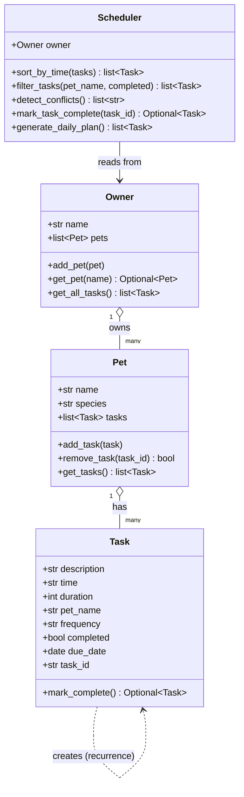

# PawPal+ (Module 2 Project)

A Streamlit pet care scheduling app that uses Python OOP to manage owners, pets, and daily tasks with algorithmic sorting, filtering, conflict detection, and recurring task automation.

## Scenario

A busy pet owner needs help staying consistent with pet care. PawPal+ lets them:

- Track care tasks (walks, feeding, meds, enrichment, grooming, etc.)
- Consider scheduling constraints (time, frequency, due dates)
- Produce a sorted daily plan and surface conflicts automatically

## Features

- **OOP Architecture** — `Task`, `Pet`, `Owner`, and `Scheduler` classes with clear responsibilities
- **Sorting by time** — Daily plan and all-task views are always in chronological order using a `lambda` key on HH:MM strings
- **Filtering** — Filter tasks by pet name, completion status, or both simultaneously
- **Conflict warnings** — `Scheduler.detect_conflicts()` flags when two tasks for the same pet share a time slot
- **Recurring task automation** — Marking a `daily` or `weekly` task complete automatically creates the next occurrence using Python's `timedelta`
- **Daily plan generation** — `generate_daily_plan()` returns only today's pending tasks, sorted chronologically
- **Streamlit UI** — Full browser interface wired to the backend; session state keeps data alive across rerenders

## Smarter Scheduling

The `Scheduler` class adds intelligence beyond simple task storage:

| Feature | Method | How it works |
|---|---|---|
| Sorting by time | `sort_by_time()` | `sorted()` with a `lambda t: t.time` key on HH:MM strings |
| Status/pet filtering | `filter_tasks()` | List comprehensions with optional `pet_name` and `completed` parameters |
| Conflict detection | `detect_conflicts()` | Hash map of `(pet_name, time)` tuples; duplicates become warning strings |
| Recurring tasks | `mark_task_complete()` | Calls `task.mark_complete()` which uses `timedelta` to create the next occurrence |

## Setup

```bash
python3 -m venv .venv
source .venv/bin/activate      # Windows: .venv\Scripts\activate
pip install -r requirements.txt
```

## Running the app

```bash
streamlit run app.py
```

## CLI demo

```bash
python3 main.py
```

Prints a sorted daily schedule, demonstrates conflict detection, recurring task creation, and filtering — all in the terminal without Streamlit.

## Testing PawPal+

```bash
python3 -m pytest
```

The test suite covers 18 cases across five areas:

| Area | What's tested |
|---|---|
| Task completion | `mark_complete()` sets `completed = True` |
| Task addition | Adding a task increases the pet's task count |
| Sorting | Tasks returned in ascending HH:MM order; empty list handled gracefully |
| Recurrence | Daily → +1 day, weekly → +7 days, one-time → `None` |
| Conflict detection | Same-pet same-time flagged; different pets same time is fine |
| Filtering | By pet name, by status, and combined |
| Daily plan | Excludes completed tasks; result is sorted; empty owner returns `[]` |

**Confidence level: ★★★★☆**
All 18 tests pass. The main untested edge case is malformed time strings (e.g. `"7:5"`) — adding input validation tests would be the next step.

## UML (Final Architecture)



## 📸 Demo

*(Add a screenshot of the running Streamlit app here)*

## Project structure

```
pawpal_system.py   # Backend logic: Task, Pet, Owner, Scheduler
app.py             # Streamlit UI wired to backend
main.py            # CLI demo script
tests/
  test_pawpal.py   # 18 pytest test cases
reflection.md      # Design and AI collaboration reflection
requirements.txt   # streamlit, pytest
```
